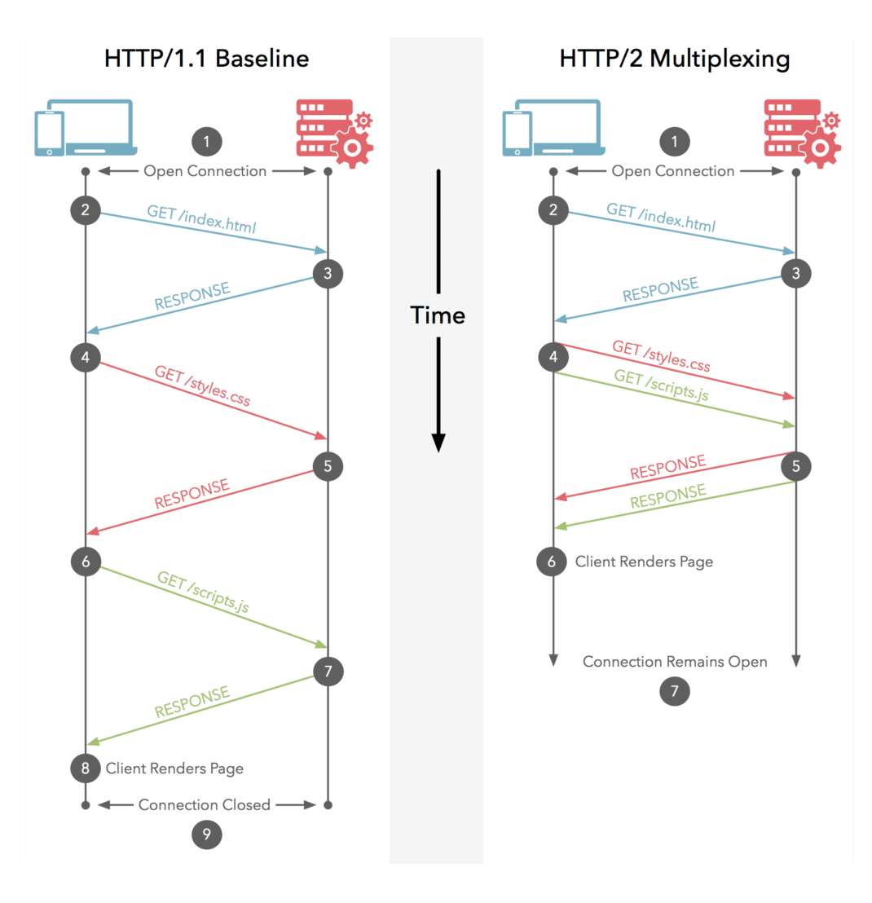
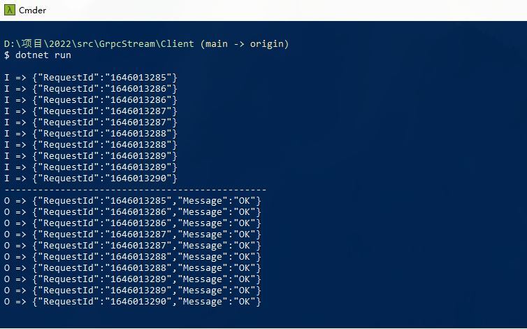

---
categories:
- 编程语言
date: 2022-02-18 09:34:36
description: ''
tags:
- gRPC
- .NET
- Streaming
- 教程
title: gRPC 流式传输极简入门指南
slug: GRPC-Streaming-Transmission-Minimalist-Guide
---

最近一直在研究 gRPC 的 [ServerReflection](https://github.com/grpc/grpc/blob/master/doc/server-reflection.md)，顾名思义，这是 gRPC 里提供的反射接口，当你需要获取某个接口的描述信息，或者是希望动态调用 gRPC 的时候，这一切就会变得非常有用，如果你经常使用 [gRPC UI](https://github.com/fullstorydev/grpcui/) 这款工具来调试 gRPC 接口，那么，你一定会注意到一件事情，即它要求服务端必须支持 ServerReflection API，而这一点在 ASP.NET Core 中已经得到支持，对此感兴趣的朋友可以参考[官方文档](https://docs.microsoft.com/zh-cn/aspnet/core/grpc/test-tools?view=aspnetcore-6.0#set-up-grpc-reflection)。当然，这并不是我想表达的重点(我就知道)。重点是什么呢？在使用 ServerReflection API 的过程中，我发现它采用了 gRPC 双向流的方式来进行交互，在过去的日子里，我研究过诸如 [WebSocket](https://developer.mozilla.org/zh-CN/docs/Web/API/WebSocket)、[Server-Sent Events](https://developer.mozilla.org/zh-CN/docs/Web/API/Server-sent_events) 等等服务器推送的技术，我意识到这是一个非常接近的技术，所以，今天这篇文章，我们来一起聊聊 gRPC 中的流式传输。


# 从 HTTP/2 说起

首先，我想说，流式传输并不是一个新的概念，这一切就好像，即使你从来没有听过流媒体的概念，可这并不妨碍你追剧、刷短视频，隐隐然有种“不识庐山真面目，只缘身在此山中”的感觉。随着网络带宽和硬件水平的不断提升，越来越多的云服务变得像水、电、天然气一样寻常，以此作喻，流式传输，就像你打开水龙头，此时，水就会源源不断地流出来，并且可以做到随用随取。因此，流式传输实际上就是指通过网络传输媒体，例如音频、视频等的技术统称，服务器可以连续地、实时地向客户端发送数据，而客户端不必等所有数据发送完就可以访问这些数据。按照实现方式的不同，流式传输可以分为 `实时流式传输` 和 `顺序流式传输` 两种，前者通常指`RTP/RTCP`，典型的场景是直播；后者通常是指由 Nginx、Apache 等提供支持的顺序下载。



如果你对 HTTP/2 有一定了解的话，就会知道它最为人所知的特性是多路复用。在 HTTP/1.1 的时代，同一个时刻只能对一个请求进行处理或者响应，换句话说，下一个请求必须要等当前请求处理完才能继续进行，与此同时，浏览器为了更快地加载页面资源，对同一个域名下的请求并发数进行了限制，所以，你会注意到一个有趣的现象，部分网站会使用多个 CDN 加速的域名，而这正是为了规避浏览器的这一限制，HTTP/1.1 时代，可以称为“半双工模式”。到了 HTTP/2 的时代，多路复用的特性让一次同时处理多个请求成为了现实，并且同一个 TCP 通道中的请求不分先后、不会阻塞，是真正的“全双工通信”。一个和本文更贴近的概念是流，HTTP/2 中引入了流(Stream) 和 帧(Frame) 的概念，当 TCP 通道建立以后，后续的所有操作都是以流的方式发送的，而二进制帧则是组成流的最小单位，属于协议层上的流式传输。

# gRPC 中的流式传输

OK，现在我们正式开始 gRPC 流式传输的话题。首先，对于一个 gRPC 接口而言，它的起源是 Protobuf 定义。所以，一个最为直观的认识是从 Protobuf 定义入手：

```protobuf
  // 普通 RPC
  rpc SimplePing(PingRequest) returns (PingReply);

  // 客户端流式 RPC
  rpc ClientStreamPing(stream PingRequest) returns (PingReply);

  // 服务器端流式 RPC
  rpc ServerStreamPing(PingRequest) returns (stream PingReply);

  // 双向流式 RPC
  rpc BothStreamPing(stream PingRequest) returns (stream PingReply);
```

可以注意到，相比普通的 RPC 方法(UnaryCall)，采用流式传输的 gRPC 接口，主要是多了一个`stream`关键字。当该关键字修饰参数时，表示这是一个客户端流式的 gRPC 接口；当该参数修饰返回值时，表示这是一个服务器端流式的 gRPC 接口；当该关键字同时修饰参数和返回值时，表示这是一个双向流式的 gRPC 接口。作为类比，双向流式的 gRPC 接口，约等于 [WebSocket](https://developer.mozilla.org/zh-CN/docs/Web/API/WebSocket)，即客户端、服务器端都可以以流的形式收/发数据；服务器端流式的 gRPC 接口，约等于 [Server-Sent Events](https://developer.mozilla.org/zh-CN/docs/Web/API/Server-sent_events)，即服务器端以流的形式发数据。同理，客户端流式的 gRPC 接口，即客户端以流的的形式发数据。

我为什么会突然对这个话题产生兴趣呢？个人以为，主要有两个原因：其一，是工作中使用流式传输的机会不多，即使遇到数据量特别大的场合，大家想到的一定是修改 gRPC 数据传输的大小，而不是采用流式传输的做法；其二，是我注意到像 [Istio](https://istio.io/)、[Envoy](https://www.envoyproxy.io/)、[Nacos](https://nacos.io/zh-cn/) 等项目，内部都是用 gRPC 作为通信协议，当你需要实现一个控制平面的时候，你会发现那里有大量的流式 gRPC 接口等着你去实现。此前，我有一点关乎 gRPC 的想法，譬如动态地为 [gRPC-JSON Transcoder](https://www.envoyproxy.io/docs/envoy/latest/configuration/http/http_filters/grpc_json_transcoder_filter) 生成配置信息、利用 [ServerReflection](https://github.com/grpc/grpc/blob/master/doc/server-reflection.md) 扩展 Swagger 等等，毫无疑问，这一切都需要你去了解 gRPC 的流式传输，一组重要的 API 是 `IAsyncStreamReader<T>` 和 `IAsyncStreamReader<T>`:

```csharp
// 1、调用 ServerReflection 获取 gRPC 服务
var callResult = _serverReflectionClient.ServerReflectionInfo(
    deadline: deadline, 
    cancellationToken: cancellationToken
);

// 2、定义一个 Task 来解析服务端响应的流
var resolveServiceListTask = Task.Run(async () =>
{
    while (await callResult.ResponseStream.MoveNext(cancellationToken))
    {
        foreach (var service in callResult.ResponseStream.Current.ListServicesResponse.Service)
        {
            Console.WriteLine(service.Name);
        }
    }
});

// 3、客户端以流的方式写入参数
var request = new ServerReflectionRequest() { ListServices = "" };
await callResult.RequestStream.WriteAsync(request);
await callResult.RequestStream.CompleteAsync();

// 4、客户端以流的方式读出结果
await resolveServiceListTask;
```

如图所示，你大概可以理解 gRPC 流式传输的运作过程，`RequestStream` 实现了 `IAsyncStreamWriter<T>` 接口，负责流的写入，调用 `CompleteAsync()` 方法时表示数据已经写完；`ResponseStream` 实现了 `IAsyncStreamReader<T>` 接口，负责流的读取，典型的迭代器模式，如果你听说过 C# 8.0 里的异步流(AsyncStream)，就应该会知道，它属于可枚举类(Enumerable)异步变体，我相信，`MoveNext()` 和 `Current` 就不需要再做多余的解释啦，哈哈！

## 客户端流

对于客户端流式 gRPC 接口而言，客户端负责写入流，服务器端负责读取流，所以，`ClientStreamPing()` 会生成下面的方法签名，这里是一个简单的实现：

```csharp
public override async Task<PingReply> ClientStreamPing(
    IAsyncStreamReader<PingRequest> requestStream, 
    ServerCallContext context)
{
    // 从 IAsyncStreamReader<T> 中读取流并放入队列
    var requestQueue = new Queue<string>();
    while (await requestStream.MoveNext())
    {
        requestQueue.Enqueue(requestStream.Current.RequestId);
    }
    
    // 从队列中取出数据并返回
    if (requestQueue.TryDequeue(out var requestId))
    {
        return new PingReply() { RequestId = requestId, Message = "OK" };
    }

    return new PingReply() { RequestId = string.Empty, Message = "" };
}
```

此时，客户端对应实现如下，继续沿用 `IAsyncStreamWriter<T>` 的套路：

```csharp
var callResult = heartBeatClient.ClientStreamPing();
await callResult.RequestStream.WriteAsync(new PingRequest() { 
    RequestId = GetCurrentTimeStamp().ToString() 
});
await callResult.RequestStream.CompleteAsync();
var reply = await callResult.ResponseAsync;
```

## 服务器端流

服务器端的流式 gRPC，意味着服务端会通过 `IAsyncStreamWriter<T>` 以流的方式写入数据：

```csharp
 public override Task ServerStreamPing(
     PingRequest request, 
     IServerStreamWriter<PingReply> responseStream, 
     ServerCallContext context)
{
    responseStream.WriteAsync(new PingReply() { 
        RequestId = request.RequestId, 
        Message = "OK" 
    });
    return Task.CompletedTask;
}
```

此时，客户端还是像使用普通方法一样调用即可：

```csharp
var reply = heartBeatClient.ServerStreamPing(new PingRequest() { 
    RequestId = GetCurrentTimeStamp().ToString() 
});
```


## 双向流

一旦我们熟悉了这个套路，理解双向流就再没有什么难度，客户端和服务器端都用 `IAsyncStreamWriter<T>` 和  `IAsyncStreamWriter<T>` 进行读写即可：

```csharp
// 读数据
var requestQueue = new Queue<string>();
while (await requestStream.MoveNext())
{
    requestQueue.Enqueue(requestStream.Current.RequestId);
}

// 写数据
while (requestQueue.TryDequeue(out var requestId))
{
    await responseStream.WriteAsync(new PingReply() { 
        RequestId = requestId, 
        Message = "OK" 
    });
}
```

同理，客户端采用类似的做法，这里我们发 10 次心跳看看：

```csharp
//  写数据
var callResult = heartBeatClient.BothStreamPing();

for (var i = 0; i < 10; i++)
{
    await callResult.RequestStream.WriteAsync(new PingRequest() { 
        RequestId = GetCurrentTimeStamp().ToString() 
    });
    Thread.Sleep(500);
}

await callResult.RequestStream.CompleteAsync();

// 读数据
while (await callResult.ResponseStream.MoveNext(CancellationToken.None))
{
    var reply4 = callResult.ResponseStream.Current;
}
```

此时，我们就可以得到下面的结果：



个人感觉，这个可以用在那些需要做双向通信的场合，譬如心跳检测、数据看板、日志监控等等，坦白来讲，相对于 [WebSocket](https://developer.mozilla.org/zh-CN/docs/Web/API/WebSocket)、[Server-Sent Events](https://developer.mozilla.org/zh-CN/docs/Web/API/Server-sent_events) 等等服务器推送技术，gRPC 的双向流优势并不显著，唯一的优势可能是 HTTP/2 多路复用带来的性能上的提升。


# 本文小结

最近的状态一直不太好，因为工作中的琐事消耗了大量精力。因而，这篇平淡如白开水般的线性叙事，委实不能被称之为一篇博客，而这大概就是我这段时间的真实写照。作为一名双子座，我的好奇心常常引导着我去关注那些意外的收获，就像 gRPC 里的流式传输，本质上因为我想通过  [ServerReflection](https://github.com/grpc/grpc/blob/master/doc/server-reflection.md) 为 gRPC 构建一份 Swagger 风格的 API 文档，这个工作目前还有些悬而未决的问题。当然，在这个过程中，大致搞懂了如何去动态调用一个 gRPC 接口，因为 [FluentGrpc.Gateway](https://github.com/qinyuanpei/FluentGrpc.Gateway) 目前依赖 gRPC 生成客户端代码，或者说这种建立在动态链接库上的方案有一定的缺陷。类似地，工作中发现 Envoy 的 [gRPC-JSON Transcoder](https://www.envoyproxy.io/docs/envoy/latest/configuration/http/http_filters/grpc_json_transcoder_filter) 插件，需要手动配置每一个 gRPC 服务，开始琢磨怎么能让这个过程更智能一点，发现需要 Envoy 的 xDS API、了解控制平面，这种感觉就像在挖一口井，能不能看到水我不知道，每一铲子下去都有意外收获，这种探险的感觉非常有趣，唯一的平衡点在于，主动的发现永远都会比被动的接受花更多的时间。这篇流水账主要介绍了 gRPC 里流式传输，即客户端流、服务器端流和双向流，如果你足够有心，不妨回过头看看这篇文章 [ASP.NET Core gRPC 拦截器的使用技巧分享](/posts/1679688265/)，我相信你会有不一样的感悟，好了，这就是全部的内容啦，谢谢大家！